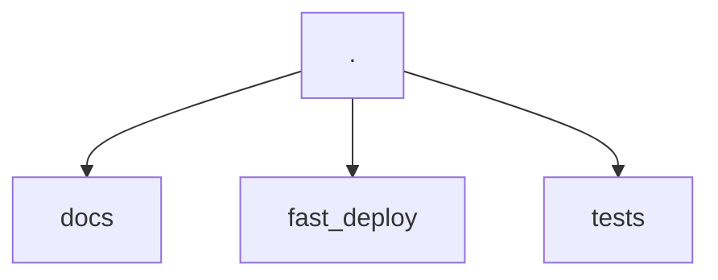
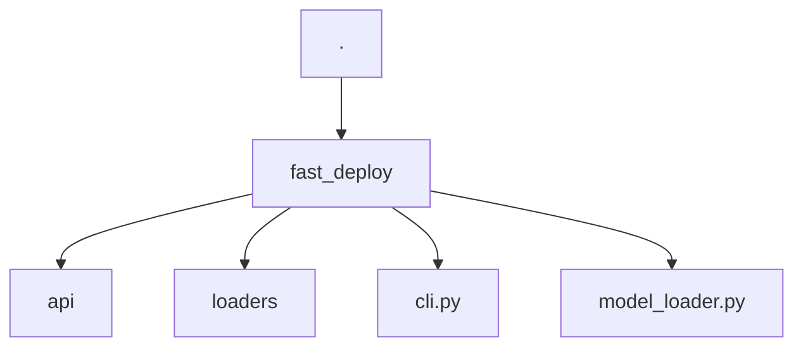
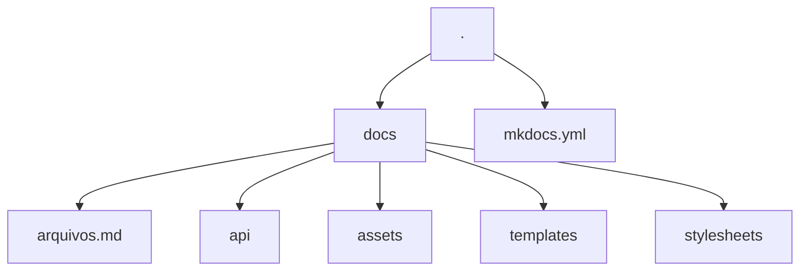

# Como contribuir

Obrigada por se interessar em contribuir no projeto `fast-deploy`! Nesse documento estão listadas as operações mais comuns que você pode precisar para contribuir.

## Como o projeto funciona?

### Estrutura do projeto


O projeto é dividido em três diretórios principais: `docs`, `fast_deploy` e `tests`. Cada diretório tem sua função específica

#### fast_deploy



O código do CLI e da biblioteca estão em `fast_deploy`. A documentação da API do código também está sendo feita em `fast_deploy`, com uso da ferramenta [mkdcstrings](https://mkdocstrings.github.io/). Essa segue o padrão de [docstrings do Google](https://sphinxcontrib-napoleon.readthedocs.io/en/latest/example_google.html). Portanto, caso altere algo no código, lembre-se de atualizar também as docstrings.

Não foram colocados exemplos para testes nas docstrings pois a aplicação depende de arquivos externos, como o arquivo do modelo. Esse comportamento foi simulado na pasta `tests`.

#### Sobre a biblioteca
A biblioteca usa python puro, mas depende externamente do Docker. As respostas das funções foram padronizadas com o retorno sempre sendo um dicionário python, pois em algum momento alguém pode querer expandir isso para uma interface gráfica ou usar em um API REST, dessa forma, acredito que um padrão que pode ser serealizado, pode ajudar bastante as pessoas.

#### O CLI
O CLI foi construído usando a biblioteca [Typer](https://typer.tiangolo.com/). Você pode checar a documentação dela para obter mais detalhes caso queira expandir as funcionalidades do CLI.

Para as respostas ricas no output da aplicação, foi usada a biblioteca [Rich](https://rich.readthedocs.io/en/stable/introduction.html). Caso queira alterar algo em relação as tabelas geradas no output, pode ir direto na [pagina da documentação](https://rich.readthedocs.io/en/stable/tables.html) referente as tabelas.

A única convenção que está sendo seguida a respeito do CLI é que já foi definido um objeto `Console` do rich e um app do `Typer` seria interessante que você continue usando esses objetos

```py title="fast_deploy/cli.py"
from rich.console import Console
from typer import Argument, Typer

...

console = Console()
app = Typer()
```

#### tests
Para os testes estamos usando o [pytest](https://docs.pytest.org/). As configurações dele podem ser encontradas no arquivo [pyproject.toml](https://github.com/laranapoli/fast-deploy/blob/master/pyproject.toml), na raiz do projeto.

!!! warning "Sobre os testes"
    Você deve saber que a flag de `addopts = "--doctest-modules"` está sendo usada. Então, caso modifique algo, esteja ciente que as docstrings também rodam testes e são a base para documentação da API, então tome cuidado com alterações.

A cobertura dos testes está sendo gerada automaticamente com [pytest-cov](https://github.com/pytest-dev/pytest-cov) e são exibidas quando a task de testes é executada:

```bash
task tests
```

!!! info "Sobre os testes"
    Saiba que os linters são requisitos para os testes.

#### Documentação

A documentação toda é baseada no uso de [mkdocs](https://www.mkdocs.org/) com o tema [mkdocs-material](https://squidfunk.github.io/mkdocs-material/).



Toda a configuração pode ser encontrada no arquivo [mkdocs.yml](https://github.com/laranapoli/fast-deploy/blob/master/mkdocs.yml) na raiz do repositório.

Também estão sendo usados diversos artifícios para complementar a documentação. Como templates do [jinja](https://jinja.palletsprojects.com/en/3.1.x/) nos lugares onde instruções podem se repetir. Caso encontre blocos como:

```html
{ %  % }
```

Saberá que se trata de um template.

Os templates estão definidos no diretório `/docs/templates`. Em alguns casos, porém, podem estar sendo chamados por variáveis com `command.run` que aparece em quase todos os arquivos de documentação. Essas macros estão sendo feitas com [mkdocs-macros](https://mkdocs-macros-plugin.readthedocs.io/en/latest/) e estão definidas no arquivo de configuração do mkdocs:

```yaml
extra:
  commands:
    run: poetry run deploy
```

##### Documentação da API

A documentação da API está sendo feita dentro dos módulos do código. Por isso os arquivos que estão no diretório `docs/api` tem uma tag:

```md
::: modulo
```

Isso quer dizer que será usado o código contido nas docstrings nesse bloco. O plugin [mkdocstrings](https://mkdocstrings.github.io/) está sendo usado para tomar conta disso.

As documentações nos módulos seguem o formato de [docstrings do google](https://sphinxcontrib-napoleon.readthedocs.io/en/latest/example_google.html), que é o padrão da biblioteca.

## Ferramentas

Esse projeto basicamente usa três ferramentas como base:

- [Poetry](https://python-poetry.org/): Para o gerenciamento do ambiente e instalação de bibliotecas
- [Taskipy](https://github.com/illBeRoy/taskipy): Para automação de tarefas rotineiras. Como executar os testes, linters, documentação e etc...
- [Docker](https://www.docker.com/): Para a conteinerização da aplicação.

Então, garanta que tem o poetry instalado para essa contribuição:

```bash
pipx install poetry
```

E também siga o [guia de instalação do docker](https://docs.docker.com/engine/install/).

## Passos para executar tarefas específicas

Aqui estão listados comandos que você pode usar para executar tarefas corriqueiras. Como clonar o repositório, como instalar as dependências, executar os testes e etc...

### Como clonar o repositório

```bash
git clone https://github.com/dunossauro/notas-musicais.git
```

### Como instalar as dependências

```bash
poetry install
```

### Como executar o CLI

```bash
poetry run deploy
```

### Como executar a verificação de código

```bash
task lint
```

### Como executar os testes

```bash
task test
```

### Como executar a documentação

```bash
task docs
```

### Tarefas em que você pode contribuir



## Não achei o que preciso aqui

Caso não tenha encontrado o que precisa, você pode abrir uma [issue no projeto](https://github.com/laranapoli/fast-deploy/issues) relatando o que não consegue fazer ou o que precisa ser melhor documentado